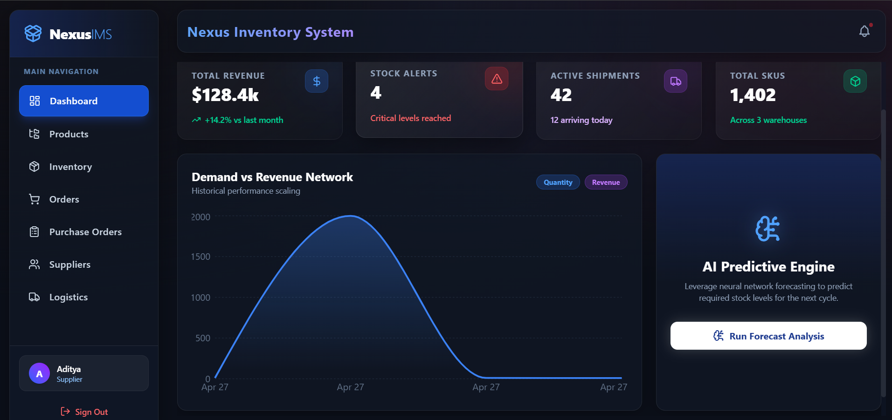

# 🚀 Smart Supply Chain Platform


=======


---

## 📌 Description

A modern, AI-augmented supply chain management platform for enterprises & SMEs, featuring real-time inventory, multi-party orders, supplier management, global logistics tracking, and demand forecasting with neural networks. Built with React, Vite, Tailwind, Node.js/Express, and Sequelize ORM.

---

## 🚀 Live Demo

- **Frontend:** [https://bts-supply-chain-frontend.onrender.com](https://bts-supply-chain-frontend.onrender.com)
- **Backend:** [<YOUR_BACKEND_DEPLOYMENT_URL>](<YOUR_BACKEND_DEPLOYMENT_URL>) <!-- Replace with actual backend link once available -->
- 🧪 **Try it out!** Register or log in to explore the dashboard, inventory, orders, and analytics features in action.

---

## 💻 Local Development

Follow these steps to set up the project for local development:

### Backend

```bash
# 1. Clone the repository
git clone https://github.com/<YOUR_GITHUB>/<YOUR_REPO>.git

# 2. Go to backend directory
cd backend

# 3. Install dependencies
npm install

# 4. Create the .env file
cp .env.example .env

# 5. Start the backend server
npm start
```

- Backend will run at: **http://localhost:5000** (default)

### Frontend

```bash
# 1. Open a new terminal window
cd frontend

# 2. Install frontend dependencies
npm install

# 3. Start the frontend development server
npm run dev
```

- Frontend will run at: **http://localhost:5173** (default)

---

## ✨ Features

- 🏪 **Inventory Tracking**: Real-time warehouse stock levels and status alerts
- 📦 **Product Catalog**: Manage SKUs, categories, and pricing
- 📑 **Order Management**: Create and track B2B customer orders
- 🧾 **Purchase Orders**: Handle inbound supplier shipments and requisitions
- 🤝 **Supplier Directory**: Manage partners with ratings/contact info
- 🚚 **Logistics Map**: Live GPS map of ongoing shipments with status
- 🧠 **AI Forecast Engine**: Predict stock needs with neural forecasting
- 🔐 **Authentication**: Secure login for Admin, Supplier, Warehouse, Retailer roles
- 📊 **Dashboards**: Visualize demand, revenue, shipments, and critical KPIs

---

## 🛠️ Tech Stack

- **Frontend:** React, Vite, Tailwind CSS, Lucide icons, Axios, React Leaflet
- **Backend:** Node.js, Express, Sequelize ORM, Postgres/MySQL/SQLite
- **AI:** Google Generative AI API (Gemini)
- **CI/CD & Hosting:** Render.com, YAML pipeline
- **Other:** dotenv, JWT authentication, CORS, bcrypt

---

## 📸 Screenshots

### 🏠 Dashboard



### 🔐 Login Page


### 📊 Analytics / Visualization


---

## 🚦 Quick Start

- **Clone the repo** and set up environment variables as shown above.
- Follow the steps in the **Local Development** section for the backend and frontend.
- Access the live frontend at [https://bts-supply-chain-frontend.onrender.com](https://bts-supply-chain-frontend.onrender.com)
- You can update environment variables for your own deployment in `backend/.env` and `frontend/.env`.

---

## 📂 Folder Structure

```
.
├── backend/
│   ├── src/
│   │   ├── controllers/
│   │   ├── models/
│   │   ├── routes/
│   │   ├── config/
│   │   └── ...
│   ├── .env.example
│   ├── add_stock.js
│   ├── create_users.js
│   └── seed.js
├── frontend/
│   ├── src/
│   │   ├── pages/
│   │   ├── components/
│   │   ├── context/
│   │   ├── assets/
│   │   └── services/
│   ├── vite.config.js
│   └── ...
├── render.yaml
└── README.md
```

---

## 🔗 API Endpoints

### Auth
- `POST /api/auth/register` – Register new user
- `POST /api/auth/login` – Login and receive JWT

### Products / Inventory
- `GET /api/products` – List products _(auth required)_
- `POST /api/products` – Add product _(Admins/Suppliers)_
- `GET /api/inventory` – List inventory _(auth required)_
- `PUT /api/inventory/update` – Update stock _(Admin/WM/Supplier)_

### Orders & PO
- `GET/POST /api/orders` – Manage sales orders
- `GET/POST /api/purchase_orders` – Manage purchase orders

### Suppliers & Warehouses
- `GET/POST /api/suppliers`
- `GET/POST /api/warehouses`

### Shipments & Demand
- `GET /api/shipments`
- `POST /api/shipments/:id/update`
- `GET /api/demand` – Historical demand _(Admin/Supplier)_
- `POST /api/demand/predict` – AI stock forecasting

> All routes require JWT. See backend for full details.

---

## 🤝 Contributing

1. Fork the repo & create your branch (`git checkout -b feature-branch`)
2. Commit your changes (`git commit -am 'feat: add something'`)
3. Push to branch (`git push origin feature-branch`)
4. Create a Pull Request

All contributions, bug reports, and suggestions welcome!

---

## 📜 License

Distributed under the ISC License.  
See [`LICENSE`](./LICENSE) for more info.

---

> _Replace `<YOUR_GITHUB>/<YOUR_REPO>` and `<YOUR_BACKEND_DEPLOYMENT_URL>` with your actual GitHub username, repo name, and backend deployment link._
